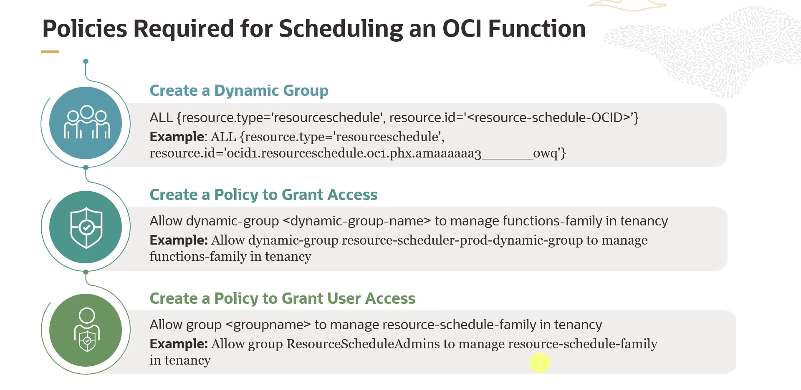

= Agendamento de OCI Functions com o Resource Scheduler
:toc:
:icons: font

== Casos de Uso para Agendamento de Funções

O agendamento de OCI Functions é uma ferramenta poderosa para a automação de tarefas rotineiras, garantindo que as aplicações sejam executadas de forma eficiente e sem intervenção manual.

As principais aplicações para o agendamento de funções incluem:
* *Automação de Manutenção e Housekeeping:*
** Executar limpeza de bancos de dados ou arquivamento de logs em intervalos regulares para manter os sistemas otimizados.

* *Processamento Periódico de Dados e Analytics:*
** Automatizar a geração de relatórios diários ou a agregação de dados de IoT em intervalos definidos.

* *Gerenciamento de Operações de Backend:*
** Agendar processos como aquecimento de cache (_cache warming_) ou sincronização de catálogos de produtos para horários de baixo tráfego.

* *Otimização de Workflows de IA/ML:*
** Agendar tarefas como o retreinamento de modelos, a geração de recomendações ou o disparo de alertas quando a performance de um modelo diminui.

* *Garantia de Conformidade e Auditoria:*
** Realizar verificações de conformidade regulares para regulamentações como HIPAA ou GDPR.

* *Alinhamento com Operações de Negócio:*
** Executar rotinas de negócio como cálculos de folha de pagamento ou gerenciamento de inventário.

* *Backups e Varreduras de Segurança:*
** Agendar backups e varreduras de segurança para fortalecer a postura de segurança e recuperação de desastres da organização.

== O Processo de Agendamento

O agendamento de uma OCI Function com o serviço *Resource Scheduler* envolve os seguintes passos:

. *Criar um _Schedule_:*
Utiliza-se o serviço Resource Scheduler para criar um novo agendamento.

. *Especificar a Função:*
Dentro das configurações do schedule, seleciona-se a função que se deseja automatizar.

. *Configurar o Agendamento:*
Define-se o tempo, a frequência e a duração do agendamento, determinando quando e com que frequência a função deve ser executada.

. *Configurar Permissões:*
Cria-se um _Dynamic Group_ que inclui o Resource Schedule e estabelece-se uma política de IAM para dar a esse grupo acesso à função.

[NOTE]
====
É possível adicionar mais funções ao mesmo schedule posteriormente, se necessário.
====

== Configuração de Permissões (IAM)

A configuração de permissões apropriadas é um passo crucial e envolve a criação de um Dynamic Group e duas políticas de IAM.

=== 1. Criação do Dynamic Group para o Schedule

Após a criação do Resource Schedule, é necessário criar um Dynamic Group para representá-lo como uma entidade que pode realizar ações. A regra de correspondência (_matching rule_) para este grupo deve referenciar o OCID do Resource Schedule.

.Formato da Regra de Correspondência:
[source,text]
----
ALL {resource.type = 'resourceschedule', resource.id = '<Resource_Schedule_OCID>'}
----

* `resource.type`: Deve ser definido como `resourceschedule`.
* `resource.id`: Deve ser o OCID do Resource Schedule que foi criado.

=== 2. Política para o Dynamic Group (Acesso à Função)

Uma vez que o Dynamic Group está criado, é preciso criar uma política de IAM que conceda a ele as permissões necessárias para gerenciar (e, portanto, invocar) as funções.

.Formato da Política:
[source,text]
----
Allow dynamic-group <dynamic_group_name> to manage functions-family in tenancy
----

O placeholder `<dynamic_group_name>` deve ser substituído pelo nome do Dynamic Group criado no passo anterior.

=== 3. Política para os Administradores (Acesso ao Scheduler)

Finalmente, os usuários que irão gerenciar os agendamentos precisam de permissão para interagir com o serviço Resource Scheduler.

.Formato da Política:
[source,text]
----
Allow group <group_name> to manage resource-schedule-family in tenancy
----

Por exemplo, para um grupo chamado `Resource-Schedule-Admins`, a política seria:
[source,text]
----
Allow group Resource-Schedule-Admins to manage resource-schedule-family in tenancy
----

[IMPORTANT]
====
Sem esta última política, os usuários não terão as permissões necessárias para criar ou gerenciar os agendamentos, mesmo que as outras configurações estejam corretas.
====

