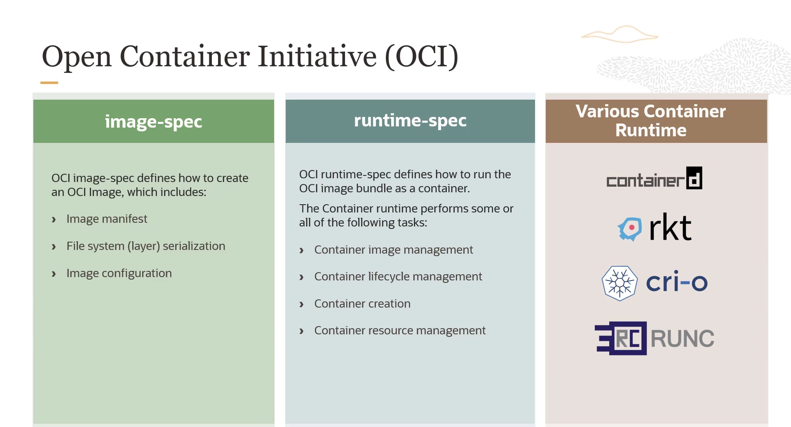
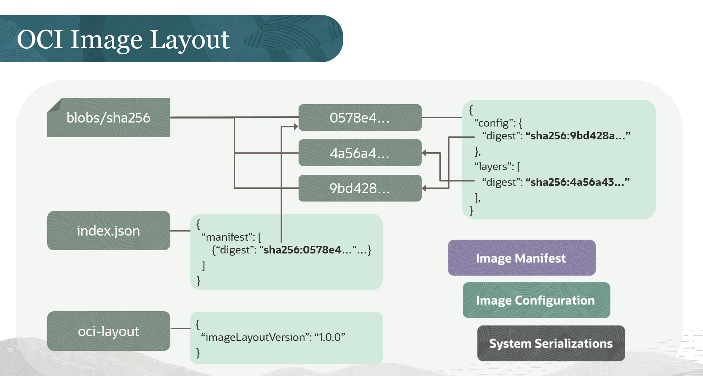

= Guia Completo: OCI Registry e a Open Container Initiative
:toc:
:icons: font

== O que é o OCI Registry (OCIR)?

O Oracle Cloud Infrastructure Registry (OCIR) é um registry gerenciado pela Oracle, projetado para simplificar o fluxo de trabalho do desenvolvimento à produção. Ele serve como um registry Docker privado para uso interno, onde desenvolvedores podem armazenar, compartilhar e gerenciar imagens de contêiner.

Suas funcionalidades principais incluem:
* *Registry Docker Privado e Público:* Pode ser configurado para uso interno restrito ou como um registry público, permitindo o download de imagens por usuários com acesso à internet.
* *Arquitetura Escalável e de Alta Disponibilidade:* Utiliza a infraestrutura da OCI para garantir a implantação confiável de aplicações.
* *Conformidade com a Open Container Initiative (OCI):* Permite o armazenamento de imagens de contêiner e outros artefatos que seguem as especificações da OCI.
* *Suporte a Imagens Multi-Arquitetura:* Suporta _manifest lists_ (também conhecidas como imagens multi-arquitetura), acomodando diversas arquiteturas como ARM e AMD64.
* *Suporte a Helm Charts:* Além de imagens de contêiner, o OCIR também pode armazenar Helm charts.
* *Acesso Privado e Seguro:* Oferece acesso privado através de um _Service Gateway_, permitindo que recursos dentro de uma VCN na mesma região acessem o OCIR de forma segura, sem exposição à internet pública.

== Vantagens Principais do OCIR

O OCIR oferece uma série de vantagens para o gerenciamento de contêineres e o ciclo de vida de desenvolvimento.

*Integração com OKE*::
Integra-se perfeitamente com o OCI Container Engine for Kubernetes (OKE), garantindo uma experiência coesa de gerenciamento de contêineres.

*Segurança e Controle de Acesso*::
Oferece flexibilidade ao permitir que os registries sejam privados ou públicos. Está intrinsecamente integrado com o OCI IAM, proporcionando autenticação direta através do OCI Identity.

*Disponibilidade Regional*::
Permite o pull eficiente de imagens de contêiner a partir da mesma região onde os deploys são realizados, otimizando a latência.

*Alta Performance*::
Aproveita a infraestrutura robusta da OCI para operações de imagem de alta performance, disponibilidade e baixa latência, aumentando a confiabilidade das operações de push e pull.

*Acesso Universal*::
Permite o uso da CLI de contêiner padrão (ex: Docker CLI) para operações de imagem a partir de diversas localidades, seja na nuvem, on-premises ou em máquinas pessoais.

*Quotas de Repositório*::
Oferece quotas generosas para armazenamento de artefatos.

[NOTE]
====
Em cada região habilitada para a tenancy, é possível estabelecer até 500 repositórios, com um limite de armazenamento cumulativo de 500 GB. Cada repositório pode conter até 100.000 imagens. A cobrança aplica-se apenas às imagens armazenadas.
====

== Conceitos Fundamentais do Registry

Para trabalhar com o OCIR, é importante compreender os seguintes conceitos.

*Imagem*::
Um template _read-only_ com instruções para criar um contêiner. Contém a aplicação e todas as suas dependências necessárias.

*Repositório*::
Uma coleção de imagens relacionadas, agrupadas por conveniência. Diferentes versões da mesma imagem de origem são agrupadas no mesmo repositório. Exemplo: `mahendra_project/acme-web-app`.

*Tag*::
Um identificador único para uma versão específica da imagem dentro de um repositório. Exemplos de tags: `4.6.1`, `4.6.2`, `latest`.

[TIP]
====
Para realizar operações de push ou pull de imagens de um repositório privado no OCIR, o usuário precisa ter um nome de usuário OCI e um *Token de Autenticação* (Auth Token).
====

== Anatomia de um Caminho de Imagem no OCIR

O caminho completo para uma imagem no OCIR é composto por vários elementos distintos.

*`Region Key`*::
Identifica a região do Container Registry. Por exemplo, `iad` para a região US East (Ashburn) e `phx` para a região US West (Phoenix).

*`Tenancy Namespace`*::
Uma string alfanumérica, aleatória e imutável, gerada automaticamente para a tenancy. Este valor pode ser encontrado no console da OCI, no menu Profile > Tenancy, no campo "Object Storage Namespace".

*`Repository Name`*::
O nome de um repositório no Container Registry. Nomes de repositório podem incluir o caractere `/`, mas isso não representa uma estrutura de diretório hierárquica.

*`Registry Identifier`*::
A combinação da `Region Key` e do `Tenancy Namespace`. A estrutura é a seguinte: `+<region_key>.ocir.io/<tenancy_namespace>+`.

*`Image Path (Caminho Completo)`*::
O caminho totalmente qualificado para uma imagem específica no registry. A estrutura é: `+<region_key>.ocir.io/<tenancy_namespace>/<repository_name>:<tag>+`.

image::images/image16.png[alt="Terminologia do OCIR", title="Terminologia do OCIR"]

== A Base de Tudo: A Open Container Initiative (OCI)

A Open Container Initiative é uma estrutura de governança aberta com o propósito de criar padrões industriais abertos para formatos e runtimes de contêineres. Foi estabelecida em junho de 2015 pela Docker e outros líderes da indústria.

Com a popularização dos contêineres, a comunidade começou a desenvolver novos runtimes com diferentes implementações. Para garantir a interoperabilidade (qualquer imagem rodando em qualquer runtime), a OCI foi criada para definir esses padrões. A Oracle é um membro da OCI e promove seu objetivo principal: construir especificações e runtimes portáteis, abertos e neutros em relação a fornecedores.

== As Especificações da OCI: Imagem e Runtime

A especificação da OCI é dividida em duas partes que cobrem diferentes fases do ciclo de vida do contêiner.

=== Image Specification

Define como criar uma imagem OCI. Inclui:
* *Image Manifest:* Fornece a configuração e o conjunto de layers para uma imagem de contêiner, para uma arquitetura e SO específicos.
* *File System Serialization:* Define como serializar um filesystem e suas alterações (as "layers").
* *Image Configuration:* Descreve o formato JSON da imagem para uso por runtimes e ferramentas de execução.

=== Runtime Specification

Define como executar um "filesystem bundle" (a imagem descompactada em disco) como um contêiner. As tarefas de um container runtime incluem:
* Gerenciamento do ciclo de vida do contêiner (criação, execução, parada).
* Gerenciamento de imagens.
* Gerenciamento de recursos do contêiner.

==== Runtimes Populares

* *containerd:* Um projeto da CNCF que gerencia o ciclo de vida completo do contêiner.
* *rkt (rocket):* Um engine de contêiner desenvolvido para ambientes cloud-native modernos.
* *CRI-O:* Uma implementação da CRI (Container Runtime Interface) do Kubernetes que permite o uso de runtimes compatíveis com OCI. É uma alternativa leve ao Docker como runtime para o Kubernetes.
* *runc:* Uma ferramenta CLI para iniciar e executar contêineres de acordo com a especificação OCI. Foi doada pela Docker e é a implementação de referência.

== Anatomia de uma Imagem OCI

=== OCI Image Layout

É uma estrutura de diretórios que organiza o conteúdo de uma imagem, consistindo em blobs (conteúdo endereçável) e referências (localização endereçável). O layout pode ser transportado por vários mecanismos (arquivos `.tar`, NFS, HTTP, etc.).

Seus componentes principais são:
* *`oci-layout` file:* Um arquivo JSON que marca a base do layout e informa sua versão.
* *`index.json` file:* O ponto de entrada obrigatório para as referências e descritores da imagem.
* *`blobs` subdirectory:* Contém o conteúdo real (as layers), organizado por algoritmo de hash.

=== O Conceito de Layers (Camadas)

Uma imagem OCI é a combinação de um manifest, uma configuração e uma ou mais serializações de filesystem, conhecidas como *layers*.

* *Read-Only Layers:* Cada layer é _read-only_ e contém apenas as diferenças em relação à camada anterior.
* *Writable Layer (Container Layer):* No topo das layers _read-only_, há uma camada _writable_. Todas as alterações durante a execução do contêiner (criação, modificação, exclusão de arquivos) são escritas apenas nesta camada.
* *Eficiência:* Isso melhora drasticamente a eficiência na distribuição de imagens. Múltiplos contêineres podem ser criados a partir da mesma imagem, e apenas múltiplas camadas _writable_ precisam ser criadas, enquanto as camadas base são compartilhadas.
* *Persistência:* A camada _writable_ existe apenas durante a vida do contêiner e é excluída quando o contêiner é removido.

== Fluxo de Trabalho Completo: Do Build ao Deploy

O processo completo, unindo todos os conceitos, pode ser resumido nos seguintes passos:

. *Criação do Dockerfile:* O desenvolvedor cria um `Dockerfile` com as instruções para construir a imagem.
. *Build da Imagem:* O comando `docker build` é utilizado para criar a imagem de acordo com as especificações do Dockerfile.
. *Push para o Registry:* A imagem é enviada (`docker push`) para um registry, como o OCIR.
. *Execução do Contêiner:* Os usuários executam a imagem (`docker run`), o que cria uma ou mais instâncias de contêiner.
. *Deploy no Runtime:* O contêiner é finalmente implantado em um ambiente de execução, como um cluster OKE, Oracle Functions ou uma VM de Compute.
