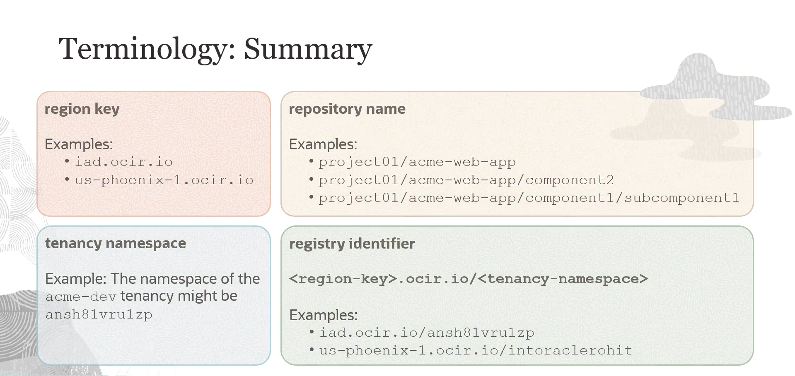

= Visão Geral do OCI Registry (OCIR)
:toc:
:icons: font

== O que é o OCI Registry?

O Oracle Cloud Infrastructure Registry (OCIR) é um registry gerenciado pela Oracle, projetado para simplificar o fluxo de trabalho do desenvolvimento à produção. Ele serve como um registry Docker privado para uso interno, onde desenvolvedores podem armazenar, compartilhar e gerenciar imagens de contêiner.

Suas funcionalidades principais incluem:
* *Registry Docker Privado e Público:* Pode ser configurado para uso interno restrito ou como um registry público, permitindo o download de imagens por usuários com acesso à internet.
* *Arquitetura Escalável e de Alta Disponibilidade:* Utiliza a infraestrutura da OCI para garantir a implantação confiável de aplicações.
* *Conformidade com a Open Container Initiative (OCI):* Permite o armazenamento de imagens de contêiner e outros artefatos que seguem as especificações da OCI.
* *Suporte a Imagens Multi-Arquitetura:* Suporta _manifest lists_ (também conhecidas como imagens multi-arquitetura), acomodando diversas arquiteturas como ARM e AMD64.
* *Suporte a Helm Charts:* Além de imagens de contêiner, o OCIR também pode armazenar Helm charts.
* *Acesso Privado e Seguro:* Oferece acesso privado através de um _Service Gateway_, permitindo que recursos dentro de uma VCN na mesma região acessem o OCIR de forma segura, sem exposição à internet pública.

== Vantagens Principais

O OCIR oferece uma série de vantagens para o gerenciamento de contêineres e o ciclo de vida de desenvolvimento.

*Integração com OKE*::
Integra-se perfeitamente com o OCI Container Engine for Kubernetes (OKE), garantindo uma experiência coesa de gerenciamento de contêineres.

*Segurança e Controle de Acesso*::
Oferece flexibilidade ao permitir que os registries sejam privados ou públicos. Está intrinsecamente integrado com o OCI IAM, proporcionando autenticação direta através do OCI Identity.

*Disponibilidade Regional*::
Permite o pull eficiente de imagens de contêiner a partir da mesma região onde os deploys são realizados, otimizando a latência.

*Alta Performance*::
Aproveita a infraestrutura robusta da OCI para operações de imagem de alta performance, disponibilidade e baixa latência, aumentando a confiabilidade das operações de push e pull.

*Acesso Universal*::
Permite o uso da CLI de contêiner padrão (ex: Docker CLI) para operações de imagem a partir de diversas localidades, seja na nuvem, on-premises ou em máquinas pessoais.

*Quotas de Repositório*::
Oferece quotas generosas para armazenamento de artefatos.

[NOTE]
====
Em cada região habilitada para a tenancy, é possível estabelecer até 500 repositórios, com um limite de armazenamento cumulativo de 500 GB. Cada repositório pode conter até 100.000 imagens. A cobrança aplica-se apenas às imagens armazenadas.
====

== Conceitos Fundamentais do Registry

Para trabalhar com o OCIR, é importante compreender os seguintes conceitos.

*Imagem*::
Um template _read-only_ com instruções para criar um contêiner. Contém a aplicação e todas as suas dependências necessárias.

*Repositório*::
Uma coleção de imagens relacionadas, agrupadas por conveniência. Diferentes versões da mesma imagem de origem são agrupadas no mesmo repositório. Exemplo: `mahendra_project/acme-web-app`.

*Tag*::
Um identificador único para uma versão específica da imagem dentro de um repositório. Exemplos de tags: `4.6.1`, `4.6.2`, `latest`.

[TIP]
====
Para realizar operações de push ou pull de imagens de um repositório privado no OCIR, o usuário precisa ter um nome de usuário OCI e um *Token de Autenticação* (Auth Token).
====

== Anatomia de um Caminho de Imagem no OCIR

O caminho completo para uma imagem no OCIR é composto por vários elementos distintos.

*`Region Key`*::
Identifica a região do Container Registry. Por exemplo, `iad` para a região US East (Ashburn) e `phx` para a região US West (Phoenix).

*`Tenancy Namespace`*::
Uma string alfanumérica, aleatória e imutável, gerada automaticamente para a tenancy. Este valor pode ser encontrado no console da OCI, no menu Profile > Tenancy, no campo "Object Storage Namespace".

*`Repository Name`*::
O nome de um repositório no Container Registry. Nomes de repositório podem incluir o caractere `/`, mas isso não representa uma estrutura de diretório hierárquica. É comum usar um prefixo para agrupar repositórios relacionados (ex: `project01/acme-web-app`), mas não há relação hierárquica entre `project01/app1` e `project01/app2`.

*`Registry Identifier`*::
A combinação da `Region Key` e do `Tenancy Namespace`. A estrutura é a seguinte:
[source,text]
----
<region_key>.ocir.io/<tenancy_namespace>
----
Exemplo: `iad.ocir.io/axaxixuanoxd`

*`Image Path (Caminho Completo)`*::
O caminho totalmente qualificado para uma imagem específica no registry. Ele combina todos os elementos anteriores com a tag da imagem.
[source,text]
----
<region_key>.ocir.io/<tenancy_namespace>/<repository_name>:<tag>
----
.Exemplos de Caminhos Completos:
[source,text]
----
# Imagem na região de Ashburn
iad.ocir.io/axaxixuanoxd/project01/acme-web-app:4.6.3

# Imagem na região de Phoenix
phx.ocir.io/axaxixuanoxd/my-hello-app:latest
----

