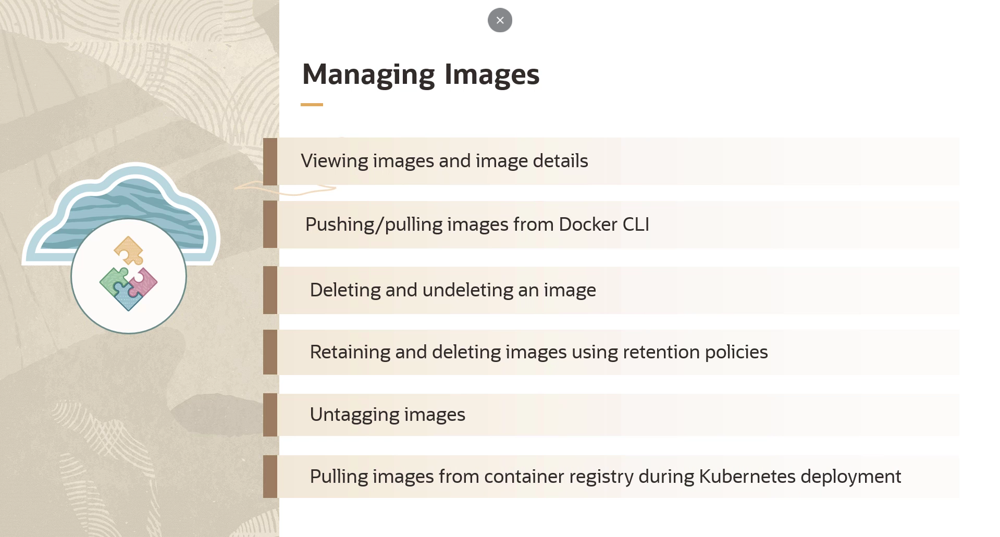

= Gerenciamento do OCI Registry (OCIR)
:toc:
:icons: font

== Pilares de Gerenciamento do OCIR

O gerenciamento do Oracle Cloud Infrastructure Registry (OCIR) pode ser dividido em três áreas principais:
. Gerenciamento de Repositórios.
. Gerenciamento de Imagens dentro dos repositórios.
. Gerenciamento da Segurança geral.

== Gerenciamento de Repositórios

=== Criação, Exclusão e Movimentação

* *Criação:* É possível criar um repositório vazio em um compartment específico. O nome do repositório deve ser único em todos os compartments da tenancy.
* *Exclusão:* Repositórios que não são mais necessários podem ser excluídos para liberar armazenamento e não exceder o limite de repositórios por região.

[WARNING]
====
A exclusão de um repositório pode levar até 48 horas para ser efetivada e para que o armazenamento seja de fato liberado.
====

* *Movimentação:* Um repositório pode ser movido de um compartment para outro. Os principais motivos para tal ação são a alteração dos usuários autorizados a acessar o repositório ou a mudança na forma como o faturamento (billing) do repositório é cobrado.

== Gerenciamento de Imagens

=== Operações Básicas: Visualização, Push e Pull

* *Visualização:* As imagens armazenadas no OCIR podem ser visualizadas através do Console da OCI ou utilizando o comando `docker images` na CLI, após autenticação no registry.
* *Push:* Para enviar uma imagem, utiliza-se primeiro o comando `docker tag` para criar uma cópia da imagem local com o caminho totalmente qualificado do destino no OCIR. Em seguida, o comando `docker push` é utilizado.
* *Pull:* Para baixar uma imagem, é necessário estar autenticado no OCIR (usando o Auth Token) e utilizar o comando `docker pull` seguido do nome totalmente qualificado da imagem.

=== Exclusão, Restauração e Untagging

* *Exclusão:* Imagens antigas ou desnecessárias podem ser excluídas para limpar o repositório.
* *Restauração (Undelete):* Uma imagem excluída pode ser restaurada por até 48 horas após a exclusão. Após esse período, ela é removida permanentemente.
* *Untagging:* Para limpar a lista de tags em um repositório sem de fato excluir as imagens, as tags podem ser removidas. Este processo é conhecido como _untagging_.

=== Políticas de Retenção de Imagens

É possível configurar políticas de retenção para excluir imagens automaticamente com base em critérios específicos.

.Hierarquia e Critérios
. *Política Global:* Cada região em uma tenancy possui uma política de retenção global. Por padrão, ela retém todas as imagens.
. *Políticas Customizadas:* Podem ser criadas para substituir a política global para repositórios específicos. Um repositório só pode ser associado a uma política customizada por vez.
. *Critérios de Seleção:*
** Imagens que não foram "puxadas" (pulled) por um determinado número de dias.
** Imagens que estão sem tags por um determinado número de dias.
. *Isenções (Exemptions):* É possível especificar uma lista de tags que, se aplicadas a uma imagem, a isentam da exclusão automática.

[IMPORTANT]
====
As políticas de retenção são específicas por região. Para aplicar uma política consistente em múltiplas regiões, é necessário configurá-la em cada região individualmente.
====

=== Integração com Kubernetes (OKE)

Para que uma aplicação no Kubernetes possa puxar imagens do OCIR, dois passos são necessários:
. *Criar um Secret do Kubernetes:* Utiliza-se o `kubectl` para criar um secret do tipo `docker-registry`. Este secret armazena as credenciais da OCI (usuário e Auth Token) necessárias para a autenticação.
. *Especificar no Manifesto:* No arquivo de manifesto da aplicação (ex: `deployment.yaml`), especifica-se a imagem a ser puxada (com seu caminho completo no OCIR) e o nome do secret criado no passo anterior, na seção `imagePullSecrets`.

.Exemplo de Manifesto de Pod no Kubernetes
[source,yaml]
----
apiVersion: v1
kind: Pod
metadata:
  name: meu-app
spec:
  containers:
  - name: meu-container
    image: iad.ocir.io/axaxixuanoxd/meu-repo/minha-app:v1
  imagePullSecrets:
  - name: ocir-secret
----

== Gerenciamento de Segurança

=== Controle de Acesso com IAM

O OCIR oferece controle de acesso granular sobre as operações que os usuários podem realizar nos repositórios. Utilizando usuários, grupos e políticas de IAM nos níveis de tenancy e compartment, é possível controlar o acesso para operações como:
* `inspect`
* `read`
* `use`
* `manage`

=== Varredura de Vulnerabilidades (Image Scanning)

O OCIR pode ser configurado para escanear imagens em busca de vulnerabilidades de segurança publicadas em bancos de dados CVE (Common Vulnerabilities and Exposures).
* O serviço utiliza o *OCI Vulnerability Scanning Service* e sua API REST para realizar a varredura.
* É necessário definir políticas de IAM que permitam ao Vulnerability Scanning Service ler os repositórios e compartments da tenancy.

[NOTE]
====
.Exemplos de Políticas para Image Scanning:
* Permitir que o serviço de scanning leia repositórios na tenancy/compartment.
* Permitir que o serviço de scanning leia compartments na tenancy.
====

== Pré-requisitos para Utilização do OCIR

Antes de poder realizar operações de push e pull de imagens, os seguintes requisitos devem ser atendidos:

. *Subscrição da Região:* A tenancy deve estar subscrita a uma ou mais regiões onde o serviço de Container Registry está disponível.
. *Acesso à Docker CLI:* É necessário ter acesso à interface de linha de comando do Docker na máquina local.
. *Permissões de IAM:* O usuário deve pertencer a um grupo com políticas que concedam as permissões apropriadas, ou pertencer ao grupo de Administradores da tenancy.
. *Credenciais de Usuário:* O usuário já deve possuir um nome de usuário OCI e um *Token de Autenticação (Auth Token)* válido para se conectar ao registry.