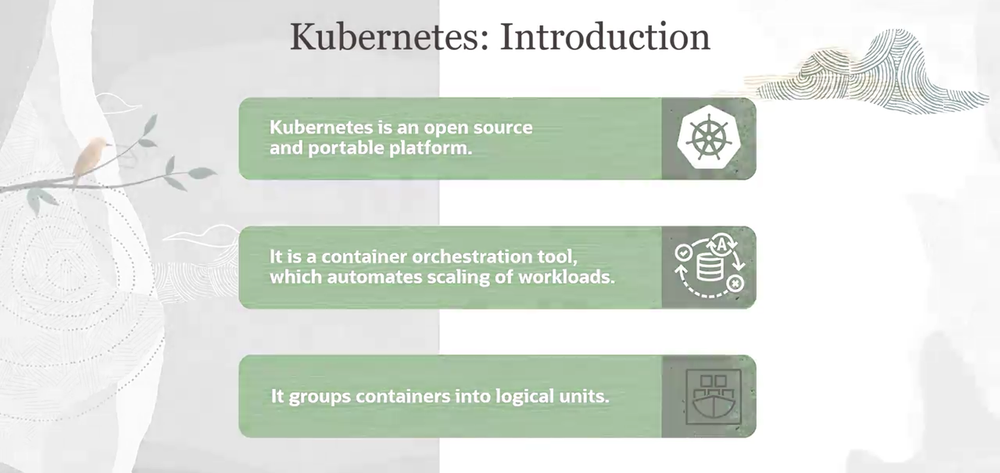
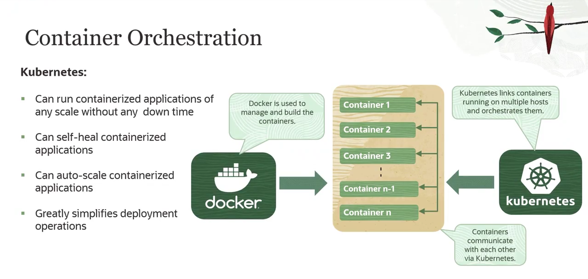

= Introdução ao Kubernetes
:toc:
:icons: font

== O Desafio do Gerenciamento de Contêineres em Escala

A utilização de contêineres para o desenvolvimento de aplicações com microsserviços apresenta desafios significativos quando operando em um ambiente distribuído e em larga escala.

Os principais problemas enfrentados incluem:
* *Falhas:* Quedas de contêineres ou falhas de hardware que podem comprometer a disponibilidade da aplicação.
* *Agendamento (Scheduling):* A necessidade de alocar contêineres em máquinas específicas com base em configurações e recursos disponíveis.
* *Atualizações e Rollbacks:* A complexidade de atualizar ou reverter versões de aplicações containerizadas sem causar tempo de inatividade (downtime).
* *Escalabilidade:* A dificuldade de escalar o número de contêineres para cima ou para baixo de forma eficiente e automática através de um conjunto de máquinas.

Esses desafios aumentam exponencialmente à medida que uma aplicação cresce em popularidade e a quantidade de contêineres passa de dezenas para centenas, tornando o gerenciamento manual inviável e propenso a erros.

== Kubernetes como Solução de Orquestração

Para resolver os desafios do gerenciamento em escala, surge o Kubernetes.

=== Definição e Analogia

*Kubernetes* (também conhecido como K8s) é uma plataforma de código aberto, portátil e extensível para o gerenciamento de cargas de trabalho e serviços containerizados, que facilita tanto a configuração declarativa quanto a automação.

[NOTE]
====
.Analogia: O Maestro da Orquestra
Pense no Kubernetes como o maestro de uma orquestra. Assim como o maestro dita quantos violinos são necessários, quando devem tocar e com qual intensidade, o Kubernetes determina quantos contêineres de frontend são necessários, quais serviços de backend eles consomem e quantos recursos (CPU, memória) devem ser dedicados a cada um. Ele orquestra todos os componentes para que funcionem em harmonia.
====

=== Arquitetura Fundamental

A arquitetura do Kubernetes é baseada em um modelo de cluster com dois tipos principais de nós:

*`Master Node (Nó Mestre)`*::
O "cérebro" do cluster. É responsável por gerenciar o estado do cluster, tomar decisões globais de agendamento (scheduling), detectar e responder a eventos (como a queda de um nó).

*`Worker Nodes (Nós de Trabalho)`*::
As máquinas (físicas ou virtuais) que executam as aplicações. Cada Worker Node é gerenciado pelo Master Node e é responsável por executar os Pods.

*`Pods`*::
A menor e mais simples unidade de deploy no Kubernetes. Um Pod representa um conjunto de um ou mais contêineres que são agrupados como uma unidade de trabalho. Os contêineres dentro de um Pod compartilham recursos de rede e armazenamento.

== O Modelo Declarativo em Operação

O Kubernetes opera com base em um modelo declarativo. Em vez de emitir comandos imperativos (ex: "execute este contêiner nesta máquina"), o operador define o *estado desejado* da aplicação.

O fluxo de trabalho é o seguinte:
. O operador define o estado desejado em arquivos de manifesto (geralmente em formato YAML), especificando, por exemplo, que deseja três instâncias (Pods) do microsserviço A e duas instâncias dos microsserviços B e C.
. Essa definição é submetida ao Master Node.
. A partir desse ponto, o Kubernetes assume o controle. O Master Node agenda e implanta os Pods nos Worker Nodes disponíveis, levando em consideração a carga e a disponibilidade de cada um.
. O Kubernetes monitora continuamente o estado atual do cluster e o compara com o estado desejado. Se houver uma divergência (ex: um Worker Node falha e seus Pods são destruídos), o Kubernetes age automaticamente para corrigir, iniciando novos Pods em outros Worker Nodes saudáveis para restaurar o estado desejado.

Este modelo remove do operador a complexidade do gerenciamento de contêineres individuais, permitindo que ele se concentre em tarefas de maior valor, como observabilidade e segurança da aplicação.

== Capacidades Essenciais do Kubernetes

A abordagem de orquestração do Kubernetes oferece um conjunto de capacidades poderosas para aplicações containerizadas.

* *Gerenciamento de Cargas de Trabalho:* Permite o deploy e gerenciamento de aplicações em qualquer escala, sem downtime, através de estratégias como _rolling updates_.
* *Self-Healing (Autocorreção):* Reinicia contêineres que falham, substitui e reagenda contêineres quando nós morrem, e remove contêineres que não respondem a verificações de saúde (health checks), tornando as aplicações resilientes a falhas.
* *Autoscaling (Autoescalonamento):* Ajusta automaticamente o número de contêineres em execução com base no uso de CPU ou outras métricas, garantindo a utilização ótima dos recursos da nuvem e atendendo às variações de carga de trabalho.
* *Simplificação de Operações:* Processos de deploy complexos podem ser executados de forma confiável com poucos comandos, abstraindo a complexidade da infraestrutura subjacente.

Com estas capacidades, o Kubernetes melhora significativamente a performance, flexibilidade e disponibilidade de aplicações, facilitando a orquestração de contêineres.

