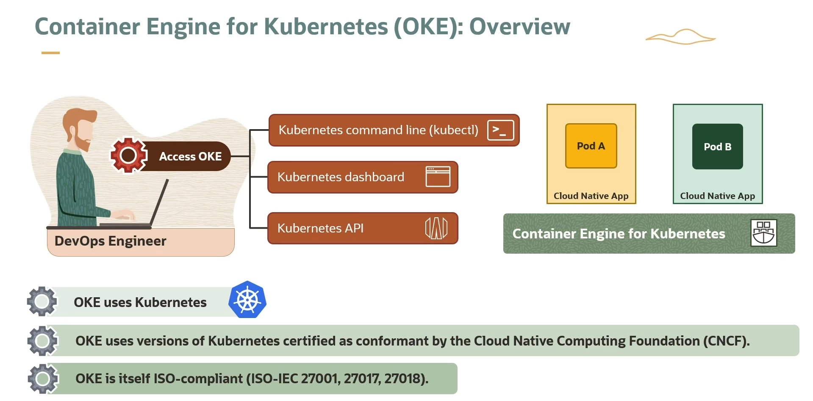
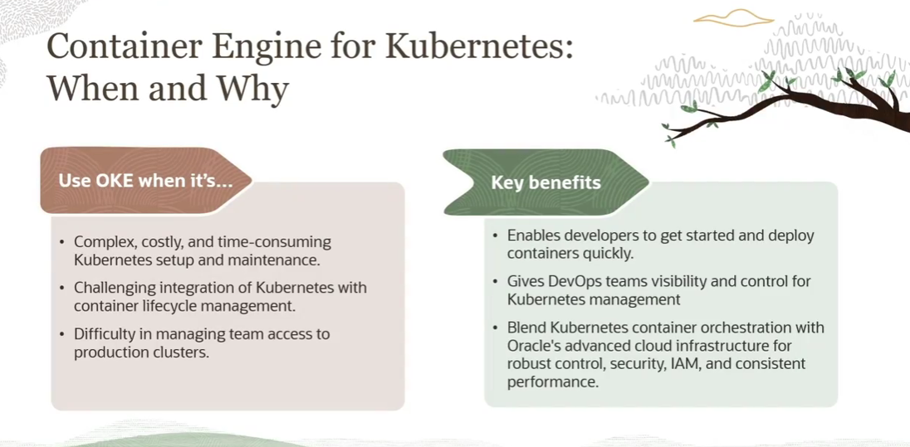

= Introdução ao OCI Container Engine for Kubernetes (OKE)
:toc:
:icons: font

== O que é o OKE?

O Oracle Cloud Infrastructure Container Engine for Kubernetes (OKE) é um serviço totalmente gerenciado, escalável e de alta disponibilidade que permite a implantação de aplicações containerizadas na nuvem.

=== Flexibilidade e Conformidade

O OKE oferece um conjunto de características que garantem flexibilidade na implantação e conformidade com padrões de mercado.

* *Tipos de Nós (Nodes):*
** É possível especificar se as aplicações serão executadas em *Virtual Nodes* ou *Managed Nodes*, oferecendo diferentes níveis de gerenciamento e controle. Independentemente da escolha, o OKE os provisiona eficientemente dentro da tenancy do usuário na OCI.

* *Criação de Clusters:*
** A criação de clusters OKE é simplificada e pode ser realizada através de duas ferramentas principais: o Console da OCI e a API REST.

* *Base em Kubernetes CNCF-Conformant:*
** O OKE utiliza versões do Kubernetes que são certificadas como conformes pela Cloud Native Computing Foundation (CNCF). Isso garante interoperabilidade e aderência aos padrões da indústria.

* *Conformidade e Segurança:*
** O serviço é compatível com os padrões ISO/IEC 27001, 27017 e 27018, o que atesta a segurança e a confiabilidade da plataforma.

== Modelo de Gerenciamento e Acesso

O OKE opera em um modelo de responsabilidade compartilhada, onde a Oracle gerencia a complexidade do control plane, e o cliente gerencia os recursos que executam suas aplicações.

=== O que a Oracle Gerencia (Control Plane)

A Oracle é responsável pelo gerenciamento de todos os Master Nodes (o Control Plane) do cluster. Isso inclui:
* *Componentes Master:* `etcd`, `API Server`, `Controller Manager`, entre outros.
* *Alta Disponibilidade:* Múltiplas cópias dos componentes master são distribuídas entre diferentes Domínios de Disponibilidade (Availability Domains) para garantir a resiliência.
* *Componentes Adicionais:* A Oracle também gerencia o Kubernetes Dashboard.
* *Mecanismos de Self-Healing:* Os mecanismos de autocorreção tanto para o cluster quanto para os Worker Nodes são gerenciados pela Oracle.

=== O que o Cliente Gerencia (Worker Nodes)

O cliente tem controle total sobre os Worker Nodes. Isso permite:
* *Criação e Controle:* Gerenciar os nós de trabalho dentro de sua própria tenancy.
* *Flexibilidade de Shapes:* Utilizar diferentes tipos de Compute Shapes (configurações de VM) para os Worker Nodes, adequando os recursos às necessidades da aplicação.

=== Métodos de Acesso ao Cluster

Após a criação, o cluster pode ser acessado e gerenciado através de ferramentas padrão do Kubernetes:
* *Kubernetes CLI (`kubectl`)*
* *Kubernetes Dashboard*
* *API do Kubernetes*

== Vantagens e Proposta de Valor

O OKE foi projetado para simplificar a adoção e operação do Kubernetes na nuvem.

* *Simplificação do Ambiente Kubernetes:*
** Reduz a complexidade, o custo e o tempo associados à construção e manutenção de ambientes Kubernetes, tanto para os Master Nodes quanto para os Worker Nodes.

* *Integração com o Ecossistema OCI:*
** OKE se integra perfeitamente com diversos produtos de gerenciamento do ciclo de vida de contêineres, incluindo:
*** Container Registries (OCIR)
*** Frameworks de CI/CD (OCI DevOps Service)
*** Soluções de Networking (OCI VCN)
*** Opções de Storage (Block Volume, File Storage)
*** Recursos de Segurança

* *Controle de Acesso Granular:*
** Fornece as ferramentas necessárias para gerenciar e controlar o acesso de equipes a clusters de produção de forma segura e direta, utilizando o OCI IAM.

* *Convergência de Benefícios:*
** *Para Desenvolvedores:* Permite o deploy rápido de contêineres.
** *Para Times de DevOps:* Oferece visibilidade e controle para um gerenciamento Kubernetes transparente.
** *Para a Arquitetura:* Une a orquestração de contêineres do Kubernetes com a infraestrutura avançada da Oracle Cloud, resultando em controle robusto, segurança de alto nível, integração com IAM e performance consistente.

