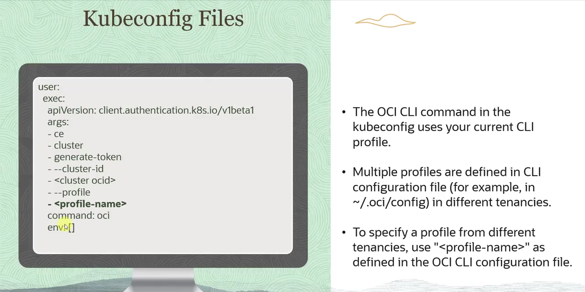
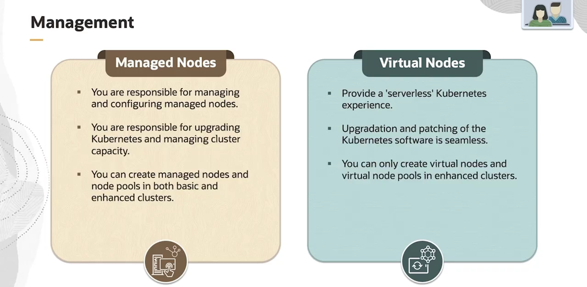

= Acessando Clusters OKE com kubectl e kubeconfig
:toc:
:icons: font

== Visão Geral do Acesso ao Cluster

A principal ferramenta para gerenciar um cluster criado com o OCI Container Engine for Kubernetes (OKE) é a interface de linha de comando do Kubernetes, `kubectl`.

É possível utilizar a instância do `kubectl` que já vem instalada no *OCI Cloud Shell* ou optar por uma instalação local na máquina do usuário. Em ambos os casos, antes de executar comandos, é necessário configurar o `kubectl` para que ele saiba a qual cluster se conectar. Isso é feito através do arquivo `kubeconfig`.

== O Arquivo kubeconfig no Contexto OKE

O arquivo `kubeconfig` é a chave para a comunicação entre o cliente `kubectl` e o endpoint da API do Kubernetes de um cluster OKE.

=== Localização e Propósito

* *Localização Padrão:* O arquivo, geralmente nomeado `config`, é armazenado no diretório home do usuário, dentro de um subdiretório oculto chamado `.kube` (`~/.kube/config`).
* *Propósito:* Ele contém todos os detalhes necessários para `kubectl` encontrar, autenticar e se comunicar com um ou mais clusters.

=== Estrutura e Autenticação Dinâmica

O `kubeconfig` para um cluster OKE possui características específicas:
* *Contexts:* O arquivo pode conter múltiplos "contextos", permitindo que um único arquivo gerencie a conexão com vários clusters diferentes. O elemento `current-context` especifica qual cluster é o alvo padrão para os comandos `kubectl`.
* *Comando OCI CLI Embutido:* O arquivo gerado pelo OKE inclui um comando que invoca a OCI CLI. Este comando é executado em segundo plano a cada chamada do `kubectl` para gerar dinamicamente um token de autenticação de curta duração.
* *Tokens de Curta Duração:* Os tokens gerados são específicos para o cluster e para o usuário individual.

[WARNING]
====
O arquivo `kubeconfig` é de uso individual e intransferível. Ele contém credenciais dinâmicas associadas a um único usuário. Cada usuário que precisa de acesso a um cluster deve gerar e utilizar seu próprio arquivo `kubeconfig`.
====

== Configurações Avançadas e Casos de Uso

É possível customizar o comportamento do `kubeconfig` para cenários mais complexos, como o uso de múltiplos perfis de OCI CLI ou a autenticação com MFA.

=== Utilizando Múltiplos Perfis da OCI CLI

Se o arquivo de configuração da OCI CLI (`~/.oci/config`) contém múltiplos perfis (para diferentes tenancies ou usuários), é necessário instruir o `kubeconfig` sobre qual perfil utilizar.

.Existem dois métodos para isso:
. *Modificar o arquivo `kubeconfig`:*
+
Adicione o argumento `--profile <profile-name>` na seção de argumentos do comando `oci` dentro do arquivo `kubeconfig`.
. *Definir uma Variável de Ambiente:*
+
Antes de executar os comandos `kubectl`, defina a variável de ambiente `OCI_CLI_PROFILE`.
[source,bash]
----
export OCI_CLI_PROFILE=<profile-name>
----

=== Lidando com Multi-Factor Authentication (MFA)

Se uma política de IAM exige o uso de MFA, o `kubeconfig` precisa ser ajustado para suportar essa verificação.
. *Modificar o arquivo `kubeconfig`:*
+
Adicione os argumentos `--auth` e `security_token` à seção de argumentos do comando `oci`. É crucial que o perfil especificado seja o do usuário verificado por MFA.
+
[source,text]
----
args:
- "ce"
- "cluster"
- "generate-token"
- "--cluster-id"
- "<cluster-ocid>"
- "ocid1.cluster.oc1.iad.xxxxxxxx"
- "--profile"
- "<oci-profile-name>"
- "--auth"
- "security_token"
command: oci
env: []
----
. *Usar a Variável de Ambiente:*
+
Alternativamente, defina a variável `OCI_CLI_PROFILE` para o nome do perfil do usuário verificado por MFA antes de usar `kubectl`.

=== Acesso para Processos Automatizados (CI/CD)

Os tokens de autenticação gerados via OCI CLI são destinados a usuários individuais. Para processos automatizados e ferramentas (como pipelines de CI/CD) que precisam acessar o cluster, a abordagem recomendada é criar um *Kubernetes Service Account* e utilizar seu token de autenticação de longa duração no `kubeconfig`.

== Verificação da Conexão

Após configurar o arquivo `kubeconfig`, é fundamental verificar se o `kubectl` consegue se conectar ao cluster.
O comando a seguir é utilizado para este fim:
[source,bash]
----
kubectl get nodes
----
Se a configuração estiver correta, o comando retornará a lista de nós (worker nodes) disponíveis no cluster Kubernetes, confirmando a conectividade e a autenticação bem-sucedidas. Se a autenticação falhar (por exemplo, um usuário não verificado por MFA tentando acessar um cluster protegido por MFA), a API retornará uma mensagem de "não autorizado".

Para uma melhor visualização, voltar no módulo 3 (mais especificamente no "Acessing a Cluster using Kubeclt") e verificar a lista de exemplos de comandos que podem ser utilizados para verificar a conectividade com o cluster.