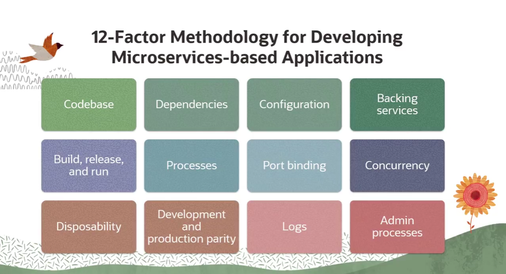
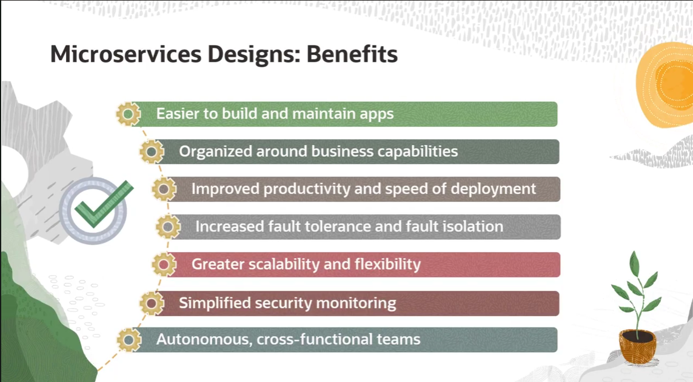
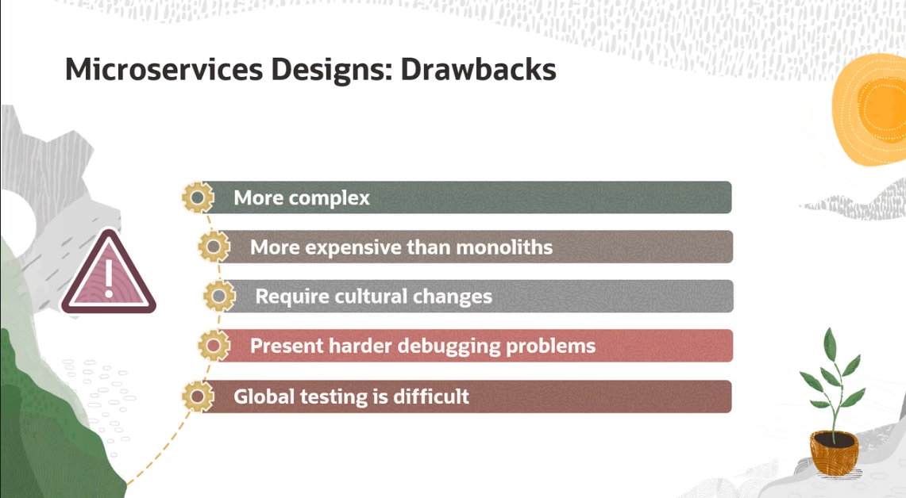

= Anotações de Dev: Design de Microsserviços e a Metodologia 12-Factor App
:toc:
:icons: font

== A Receita do Bolo: Metodologia 12-Factor App

Ok, já sabemos que microsserviços são uma abordagem melhor que monolitos para muita coisa. A questão é: *como* a gente faz isso direito?

Uma metodologia que caiu como uma luva para microsserviços é a **12-Factor App**. Foi criada pela galera do Heroku lá em 2011 e define 12 boas práticas para construir aplicações que rodam como um serviço (SaaS).

== Os 12 Mandamentos do App Moderno

Esses são os 12 fatores. É bom ter isso na ponta da língua.

. *I. Codebase*
+
--
*Um app, um repo.* Cada microsserviço vive em seu próprio repositório de código (Git). Nada de compartilhar repo com outros serviços. Isso simplifica DEMAIS o CI/CD.
--

. *II. Dependências*
+
--
*Declare e isole as dependências explicitamente.* Nada de assumir que uma lib já está instalada no sistema. A gente usa gerenciadores de pacotes (Maven, Gradle, npm, pip) para declarar tudo.
[TIP]
====
Para dependências de sistema (tipo um `curl` ou `jq`), em um ambiente de contêineres a gente resolve isso no `Dockerfile`. Em ambientes mais antigos, ferramentas como Chef ou Ansible eram usadas.
====
--

. *III. Configurações*
+
--
*Guarde as configurações no ambiente.* A config (credentials de DB, URLs de APIs, etc.) NUNCA deve estar no código. Ela deve ser injetada no ambiente, geralmente via variáveis de ambiente (env vars). Isso permite alterar a config sem precisar buildar e fazer deploy da aplicação de novo.
--

. *IV. Backing Services*
+
--
*Trate os serviços de apoio como recursos acopláveis.* Um _backing service_ é qualquer serviço que a app consome pela rede (DB, cache, fila de mensagens). A aplicação não deve se importar se o DB é um MySQL on-premise ou um serviço na nuvem (OCI Database). A troca deve ser feita apenas mudando a config (ver Fator III), sem alterar o código.
--

. *V. Build, Release, Run*
+
--
*Separe estritamente as etapas de build, release e run.*
* *Build:* Transforma o código em um artefato executável (ex: uma imagem Docker).
* *Release:* Pega o artefato do build e combina com a config do ambiente.
* *Run:* Executa a release no ambiente de destino.
Isso garante que o mesmo artefato seja promovido entre os ambientes, mudando apenas a configuração.
--

. *VI. Processos*
+
--
*Execute a app como um ou mais processos stateless.* A aplicação não deve guardar nenhum estado internamente (em memória ou em disco). Se precisar de estado, use um _backing service_ pra isso (Redis, Memcached, um DB). Isso permite escalar horizontalmente sem medo, subindo e descendo instâncias sem impacto.
--

. *VII. Port Binding*
+
--
*Exponha os serviços via port binding.* A aplicação deve ser autossuficiente e não depender de um web server externo (como Apache Tomcat) injetado em tempo de execução. Ela mesma sobe e expõe uma porta. No mundo dos microsserviços, isso também significa que o acesso ao DB de um serviço só pode ser feito via sua API, nunca diretamente.
--

. *VIII. Concorrência*
+
--
*Escale através do modelo de processos (escala horizontal).* Em vez de deixar a máquina mais forte (escala vertical), a gente sobe mais instâncias do mesmo processo (escala horizontal). Contêineres e orquestradores tornam isso trivial.
--

. *IX. Descartabilidade (Disposability)*
+
--
*Maximize a robustez com inicialização rápida e desligamento gracioso.* Os processos devem ser "descartáveis". Eles podem ser iniciados ou parados a qualquer momento. Isso é fundamental para elasticidade, deploys rápidos e recuperação de falhas. Contêineres são naturalmente descartáveis.
--

. *X. Paridade Dev/Prod*
+
--
*Mantenha os ambientes de desenvolvimento, staging e produção o mais parecido possível.* Isso evita o clássico "na minha máquina funciona". O objetivo é reduzir o tempo e as diferenças entre os ambientes para pegar bugs mais cedo. Contêineres são a melhor ferramenta para garantir essa paridade.
--

. *XI. Logs*
+
--
*Trate logs como um fluxo de eventos.* A aplicação não deve se preocupar em escrever ou gerenciar arquivos de log. Ela simplesmente joga os logs para a saída padrão (`stdout`). O ambiente de execução (plataforma de contêineres, agregador de logs) é que se vira para coletar, agregar e rotear esse fluxo de eventos para um local centralizado (Splunk, ELK Stack, etc).
--

. *XII. Processos de Admin*
+
--
*Execute tarefas de admin/manutenção como processos one-off.* Tarefas como migrações de banco de dados, limpeza de dados ou rodar um script de análise devem ser executadas em um processo separado da aplicação principal. Elas usam a mesma codebase e config da app, mas não ficam rodando continuamente.
--

== Reforçando: Por que usar Microsserviços? (Benefícios)

Já vimos alguns antes, mas não custa reforçar pra prova...

* *Baixo Acoplamento:* Os componentes podem ser desenvolvidos, substituídos e escalados individualmente.
* *Foco em Negócio:* Os serviços são organizados em torno de capacidades de negócio, não de capacidades técnicas. O objetivo final é a experiência do usuário.
* *Autonomia dos Times:* Times cross-funcionais podem trabalhar de forma autônoma em serviços específicos, o que aumenta a produtividade e a velocidade.
* *Tolerância a Falhas:* Com mecanismos de fallback, a falha de um serviço não derruba o sistema inteiro.
* *Escalabilidade e Flexibilidade:* Podemos escalar horizontalmente apenas os serviços que precisam, evitando gargalos e otimizando custos.
* *Monitoramento de Segurança Simplificado:* É mais fácil isolar ameaças em um arranjo modular do que em um monolito gigante.

== O Lado Sombrio: As Dores de Cabeça (Desvantagens)

Nem tudo é perfeito. É preciso estar ciente dos desafios.

* *Complexidade Explode:* A comunicação entre dezenas ou centenas de serviços é inerentemente complexa.
* *Mais Caro (Inicialmente):* Requer uma infraestrutura de hosting mais robusta, com mais suporte para segurança e manutenção. E, claro, times mais qualificados.
* *Debugging Vira um Inferno:* Rastrear um problema através de múltiplos serviços, cada um com seu próprio log, é um desafio enorme. Ferramentas de observabilidade são essenciais.
* *Testes Globais São Difíceis:* Testes unitários são fáceis, mas testes de integração que cobrem o sistema inteiro são bem mais complicados de orquestrar.

[WARNING]
====
A migração para microsserviços é, antes de tudo, uma *mudança cultural*. A organização precisa ter uma cultura Ágil e DevOps madura *antes* de começar. Tentar fazer a migração técnica sem a base cultural é receita para o fracasso.
====

== Conclusão: Vale a Pena a Migração?

[quote]
"Implementar microsserviços pode trazer ótimos resultados, especialmente para grandes empresas ou domínios de negócio complexos."

Não existe bala de prata. A decisão de usar microsserviços depende muito da cultura da organização, da complexidade do problema e dos objetivos de negócio. É uma jornada que, se bem executada, traz agilidade e escalabilidade, mas que cobra seu preço em complexidade e investimento.