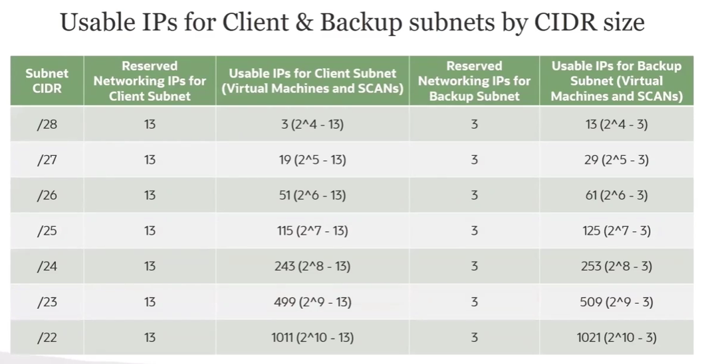

# Networking no Oracle Database@Azure

## Requisitos de Rede para Provisionamento

Ao provisionar um cluster de VMs Exadata no Oracle Database@Azure, existem requisitos de rede específicos dentro da sua VNet (Virtual Network) do Azure.

* **Azure Virtual Network (VNet):** É necessário ter uma VNet existente.
* **Sub-redes Dedicadas:** Você precisa especificar duas sub-redes distintas:
    1.  **Client Subnet:** A sub-rede à qual o cluster de VMs será conectado para o tráfego de aplicações.
    2.  **Backup Subnet:** A sub-rede usada para o tráfego de backup e para a replicação do Data Guard.
* **Delegação de Sub-rede:** Ambas as sub-redes devem ser **delegadas** ao serviço Oracle Database@Azure.
* **CIDRs Reservados (para Exadata X9M):** Os blocos de IP `100.106.0.0/16` e `100.107.0.0/16` são reservados para a interconexão interna do serviço e **não podem** ser usados nas suas sub-redes de cliente ou backup.

## Requisitos de Endereços IP

O serviço consome um número específico de endereços IP de cada sub-rede para seu funcionamento.

### Client Subnet (Sub-rede do Cliente)

* **Por VM:** Cada VM no cluster requer **4** endereços IP.
* **SCAN (Single Client Access Name):** O cluster requer **3** endereços IP para os listeners SCAN, independentemente do número de VMs.
* **Serviços de Rede:** **13** endereços IP são reservados para serviços de rede internos, por sub-rede.

**Exemplo de Cálculo (1 cluster com 2 VMs):**
* IPs para VMs: `2 VMs * 4 IPs/VM = 8 IPs`
* IPs para SCAN: `3 IPs`
* IPs para Serviços: `13 IPs`
* **Total Mínimo Necessário: `8 + 3 + 13 = 24 IPs`**

### Backup Subnet (Sub-rede de Backup)

* **Por VM:** Cada VM no cluster requer **3** endereços IP.
* **Serviços de Rede:** **3** endereços IP são reservados para serviços de rede internos, por sub-rede.

**Exemplo de Cálculo (1 cluster com 2 VMs):**
* IPs para VMs: `2 VMs * 3 IPs/VM = 6 IPs`
* IPs para Serviços: `3 IPs`
* **Total Mínimo Necessário: `6 + 3 = 9 IPs`**

## O que é a Delegação de Sub-rede (Subnet Delegation)?

A delegação de sub-rede é um recurso do Azure VNet que permite que você entregue o controle de gerenciamento de uma sub-rede específica para um serviço do Azure (ou um serviço parceiro, como o da Oracle).

* **Como funciona:** Ao delegar uma sub-rede, você está essencialmente dando permissão ao provedor de recursos do serviço (neste caso, `Oracle.Database/networkAttachments`) para injetar suas próprias NICs e gerenciar os endereços IP dentro daquele espaço.

### Benefícios da Delegação de Sub-rede

* **Simplifica o Gerenciamento:** Delega o gerenciamento complexo de IPs ao provedor de serviço, reduzindo a sobrecarga administrativa.
* **Melhora a Segurança:** Isola os recursos do serviço, permitindo que ele aplique suas próprias políticas de acesso e segurança, reduzindo o risco de exposição.
* **Aumenta a Flexibilidade:** Permite que diferentes serviços do Azure coexistam de forma segura e gerenciada dentro da mesma VNet.
* **Melhora o Desempenho:** O serviço pode otimizar o roteamento do tráfego de rede para seus próprios recursos, o que pode reduzir a latência.

