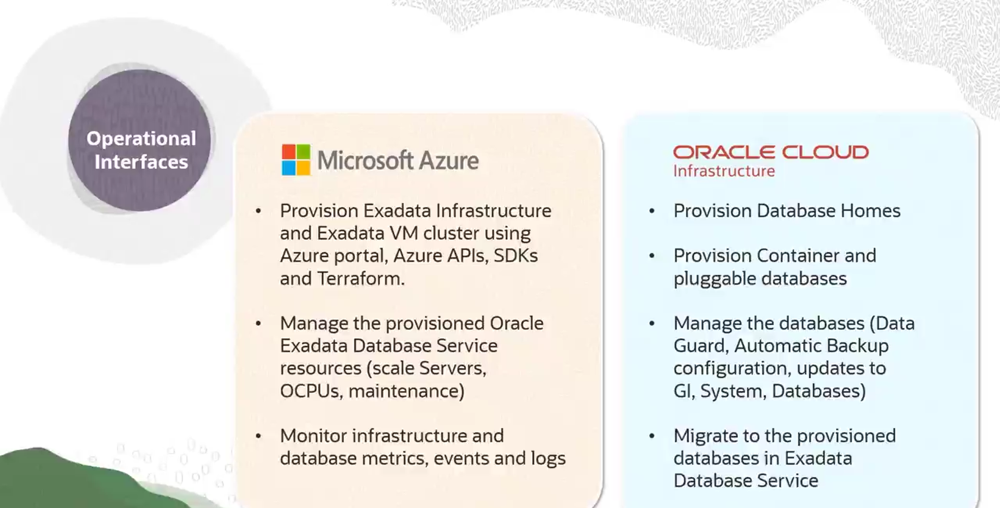

# Provisionamento de Recursos no Oracle Database@Azure

## Visão Geral do Processo

O processo de provisionamento de um Exadata Database Service no Oracle Database@Azure segue a mesma sequência lógica de um provisionamento no OCI, mas as ações são divididas entre os portais do Azure e do OCI.

A sequência é:
1.  **Provisionar a Infraestrutura Exadata** (no Azure).
2.  **Provisionar o Cluster de VMs Exadata** sobre essa infraestrutura (no Azure).
3.  **Provisionar os Bancos de Dados** (Container e Pluggable) dentro do cluster (no OCI).

## Separação de Tarefas: Portal do Azure vs. Portal do OCI

É fundamental saber qual portal usar para cada tarefa.

### Tarefas Realizadas no Portal do Azure

* **Provisionamento da Infraestrutura:**
    * Oracle Exadata Infrastructure.
    * Oracle Exadata VM Cluster.
* **Gerenciamento da Infraestrutura:**
    * Escalar servidores e OCPUs.
    * Aplicar atualizações de manutenção de software e infraestrutura.
* **Monitoramento:**
    * Visualizar métricas e eventos da infraestrutura e do banco de dados usando os serviços do Azure (como o Azure Monitor).

*As tarefas no Azure podem ser automatizadas via APIs, SDKs e Terraform do Azure.*

### Tarefas Realizadas no Portal do OCI

* **Provisionamento do Banco de Dados:**
    * Criar Oracle Database Homes (para versões específicas do banco de dados).
    * Criar Container Databases (CDBs) e Pluggable Databases (PDBs).
* **Gerenciamento do Banco de Dados:**
    * Configurar backups automáticos.
    * Habilitar o Data Guard.
    * Aplicar atualizações de Grid Infrastructure e do banco de dados.
* **Migração de Dados:**
    * Utilizar ferramentas como Zero Downtime Migration (ZDM) ou o OCI Database Migration Service para migrar dados para os bancos de dados provisionados.

## Passo a Passo do Provisionamento

### 1. Provisionar a Infraestrutura Exadata (no Azure)

* **Permissão Necessária:** O usuário deve ser membro do grupo `Oracle Database@Azure Infrastructure admin`.
* **Processo:**
    1.  No portal do Azure, navegue até o serviço **Oracle Database@Azure**.
    2.  Selecione a guia **Oracle Exadata Infrastructure** e inicie a criação.
    3.  **Básico:** Forneça a Assinatura, o Grupo de Recursos, o nome da instância e a região.
    4.  **Configuração:**
        * Selecione o modelo do Exadata.
        * Escolha o número de servidores de banco de dados (mínimo 2) e servidores de armazenamento (mínimo 3).
        * Os campos de OCPUs e armazenamento são preenchidos automaticamente.
    5.  **Manutenção:** Defina o método (rolling ou non-rolling) e o agendamento detalhado para as janelas de manutenção.

### 2. Provisionar o Cluster de VMs Exadata (no Azure)

* **Permissão Necessária:** O usuário deve ser membro do grupo `Oracle Database@Azure VM Cluster admin`.
* **Pré-requisito:** As sub-redes de cliente e backup na VNet do Azure já devem ter sido criadas e **delegadas** ao serviço.
* **Processo:**
    1.  No portal do Azure, na mesma área do serviço, selecione a guia **Oracle Exadata VM Cluster**.
    2.  **Básico:** Forneça a Assinatura, o Grupo de Recursos, o nome do cluster e a mesma região da infraestrutura.
    3.  **Configuração:**
        * Escolha o tipo de licença: **License Included** ou **BYOL**.
        * Selecione a Infraestrutura Exadata criada no passo anterior.
        * Escolha a versão do Grid Infrastructure e o fuso horário.
        * Forneça a chave pública SSH para acesso.
    4.  **Configuração (cont.):** Defina o número de nós do cluster, o shape, OCPUs por VM, memória e armazenamento local. Ajuste a quantidade de armazenamento Exadata utilizável.
    5.  **Networking:** Associe as sub-redes de cliente e backup que foram previamente delegadas.

### 3. Provisionar os Bancos de Dados (no OCI)

* **Permissão Necessária:** O usuário no OCI precisa das permissões adequadas (se a federação de identidade foi feita, o usuário do Azure herdará as permissões dos grupos replicados).
* **Processo:**
    1.  A partir da página de visão geral do VM Cluster no portal do Azure, clique no link **"Go to OCI"** para navegar diretamente para o recurso correspondente no console do OCI.
    2.  No console do OCI, crie primeiro um **Oracle Database Home** com a versão desejada do banco de dados.
    3.  Dentro do Database Home, provisione os **Container Databases (CDBs)** e **Pluggable Databases (PDBs)**.
    4.  Uma vez que os bancos de dados estejam disponíveis, configure suas aplicações para se conectarem a eles.

