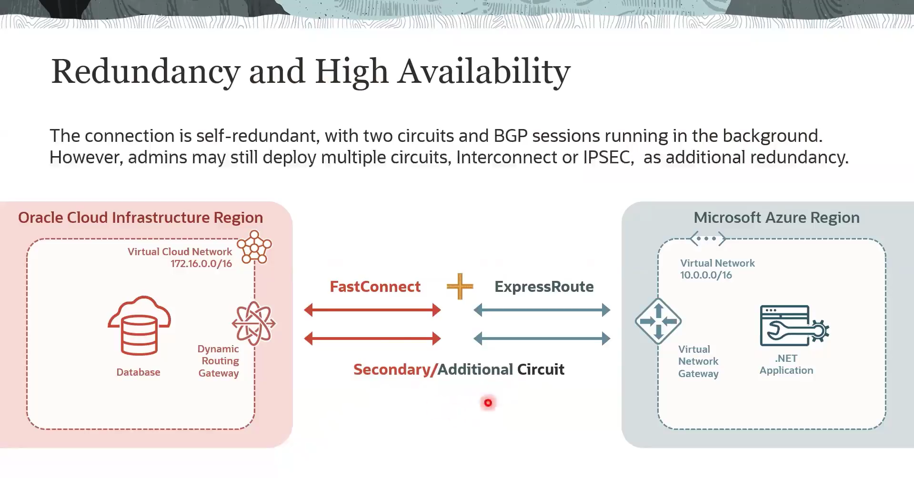

# OCI-Azure Interconnect

## O que é o OCI-Azure Interconnect?

Anunciada em 2019, é uma **parceria direta entre a Oracle e a Microsoft** que estabelece uma rede segura, de baixa latência e alta taxa de transferência entre o Oracle Cloud Infrastructure (OCI) e o Microsoft Azure.

* **Conexão Direta:** A configuração é feita uma única vez e elimina a necessidade de um provedor de rede intermediário (como os parceiros FastConnect).
* **Desempenho:** Oferece desempenho de rede consistente com uma latência de aproximadamente **2 milissegundos**.
* **Segurança:** A conexão é privada e contorna completamente a internet pública.

## Benefícios e Funcionalidades

* **Melhor de Dois Mundos:** Permite que você construa aplicações utilizando os melhores serviços de cada nuvem. Por exemplo, rodar uma aplicação .NET no Azure que acessa um Oracle Autonomous Database no OCI.
* **Identidade Unificada:** Facilita a configuração de **Single Sign-On (SSO)** federado entre o Azure AD e o OCI IAM. Isso permite que os usuários se autentiquem uma única vez para acessar aplicações em ambas as nuvens (como PeopleSoft, E-Business Suite).
* **Migração Simplificada:** Ajuda a migrar cargas de trabalho para a nuvem ou a construir aplicações nativas da nuvem de forma mais eficiente.
* **Aproveitamento de Investimentos:** Permite que você continue a alavancar os investimentos e conhecimentos existentes em tecnologias Oracle e Microsoft.

## Arquitetura da Conexão

A interconexão é composta pelos serviços de conexão privada nativos de cada nuvem:

* **Lado do OCI:**
    * O circuito virtual é o **OCI FastConnect**.
    * Ele termina em um **Dynamic Routing Gateway (DRG)**, que está anexado à sua Virtual Cloud Network (VCN).

* **Lado do Microsoft Azure:**
    * O circuito virtual é o **Azure ExpressRoute**.
    * Ele termina em um **Virtual Network Gateway**, que está anexado à sua Virtual Network (VNet).

O tráfego flui do Virtual Network Gateway (Azure) para o Dynamic Routing Gateway (OCI) e vice-versa, permanecendo sempre em uma rede privada.

### Pré-requisitos para Configuração
* **No Azure:** Ter uma VNet com sub-redes e um Virtual Network Gateway.
* **No OCI:** Ter uma VCN com sub-redes e um Dynamic Routing Gateway anexado.

## Comparativo dos Componentes de Rede

| Componente | Oracle Cloud Infrastructure (OCI) | Microsoft Azure |
| :--- | :--- | :--- |
| **Rede Virtual** | Virtual Cloud Network (VCN) | Virtual Network (VNet) |
| **Circuito Virtual**| FastConnect | ExpressRoute |
| **Gateway** | Dynamic Routing Gateway (DRG) | Virtual Network Gateway |
| **Roteamento** | Route Tables | Route Tables |
| **Segurança** | Security Lists & Network Security Groups | Network Security Groups |

## Resumo dos Benefícios da Parceria

* **Inovação:** Combine os melhores serviços de ambas as nuvens com base em recursos, desempenho e preço.
* **Experiência Unificada:** Obtenha uma experiência cross-cloud otimizada, segura e unificada.
* **Continuidade:** Continue a usar seus investimentos e habilidades existentes nas tecnologias Oracle e Microsoft.

